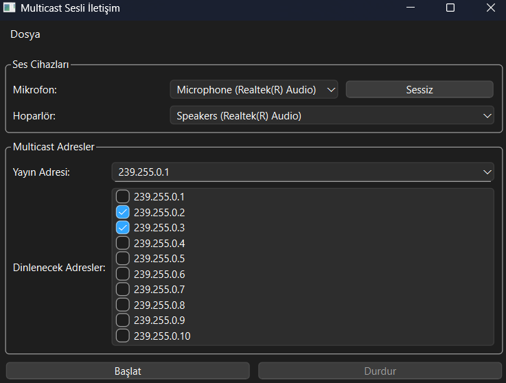
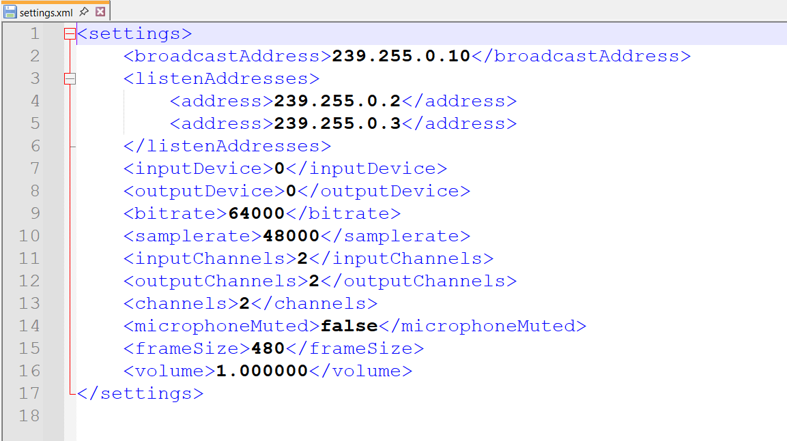

<h1 align="center">🎙️ Multicast Voice Communication App</h1>
<p align="center">
  <b>C++ • Qt • PortAudio • Opus • ASIO</b><br>
  Gerçek zamanlı multicast üzerinden sesli iletişim uygulaması
</p>

---

## ✨ Özellikler

- 🎧 Gerçek zamanlı sesli iletişim (low-latency)
- 🖼️ Kullanıcı dostu arayüz (Qt GUI)
- 📡 Multicast UDP yayın desteği
- 🧠 Jitter Buffer ile gecikme önleyici algoritma
- 🔊 Opus codec ile yüksek kaliteli ses sıkıştırma
- 📜 XML yapılandırma dosyası ile kalıcı ayarlar
- 🗂️ Basit ve özelleştirilebilir log sistemi

---

## 🔧 Kullanılan Teknolojiler

| Teknoloji     | Açıklama                                  |
|---------------|-------------------------------------------|
| `C++17`       | Temel programlama dili                    |
| `Qt Widgets`  | GUI oluşturmak için                      |
| `PortAudio`   | Cihazdan gerçek zamanlı ses alımı         |
| `Opus Codec`  | Ses sıkıştırma ve codec yönetimi         |
| `ASIO`        | Düşük gecikmeli soket haberleşmesi       |
| `Qt XML`      | Yapılandırma dosyası okuma/yazma işlemleri|

---

## 🧾 XML Ayar Sistemi

Uygulama, kullanıcı ayarlarını bir XML dosyasına kaydeder ve açılışta bu dosyayı okuyarak GUI bileşenlerini otomatik olarak günceller.

### Örnek XML:
```xml
<Settings>
    <MulticastAddress>239.255.0.1</MulticastAddress>
    <Port>12345</Port>
    <Volume>85</Volume>
</Settings>
```

### Kullanım:

- Uygulama kapanırken mevcut GUI ayarları XML'e yazılır.
- Açılışta XML'den ayarlar okunur ve `QLineEdit`, `QSlider`, `QComboBox` gibi öğeler bu değerlere göre güncellenir.

---

## 🚀 Kurulum Adımları

### 1. Gerekli Kütüphaneleri Kur

- Qt (5 veya 6)
- PortAudio
- Opus Codec
- ASIO SDK

### 2. Projeyi Qt Creator ile Aç

```bash
src/basitmulticast.pro  # Qt Creator üzerinden açılır
```

### 3. Derleme Ayarları

`.pro` dosyasına aşağıdaki dizinler uygun şekilde eklenmeli:

```pro
INCLUDEPATH += path/to/portaudio path/to/opus
LIBS += -lportaudio -lopus -lwinmm -lole32 -lws2_32
```

---

## 🎮 Kullanım Senaryosu

1. Uygulama başlatılır.
2. XML dosyasından ayarlar GUI'ye yüklenir.
3. Gönderici multicast adresine ses verisi yollar.
4. Alıcı, bu adresi dinleyerek sesi çözümler.
5. GUI üzerinden ses başlat/durdur, IP ayarı gibi işlemler yapılır.
6. Kapatırken mevcut ayarlar XML'e kaydedilir.

---

## 🗂️ Proje Yapısı

```
Multicast-main/
├── docs/                # Önceki dökümantasyonlar
├── src/                 # Ana kaynak kodlar
│   ├── audiomanager.*     # PortAudio üzerinden ses yönetimi
│   ├── codecmanager.*     # Opus ile codec işlemleri
│   ├── debuglogger.*      # Log sistemi
│   ├── JitterBuffer.h     # Gecikme önleyici buffer
│   ├── settings.xml       # XML yapılandırma dosyası
│   ├── xmlhandler.*       # Qt ile XML işlemleri
│   ├── mainwindow.*       # Qt GUI dosyaları
│   ├── main.cpp           # Uygulama girişi
│   └── basitmulticast.pro # Qt Proje Dosyası
```

---

## 🧪 Örnek Kod Parçası

```cpp
// Opus ile kodlama
int encoded_bytes = opus_encode(encoder, input_buffer, FRAME_SIZE, output_buffer, MAX_PACKET_SIZE);

// Multicast gönderimi
socket.send_to(boost::asio::buffer(output_buffer, encoded_bytes), multicast_endpoint);

// XML kaydı (Qt ile)
QDomDocument doc;
QDomElement root = doc.createElement("Settings");
root.appendChild(createTextNode(doc, "MulticastAddress", ip));
doc.appendChild(root);
// QFile ile yazılır
```

## 📸 Ekran Görüntüsü
<p align="center">
  
  
  
</p>
